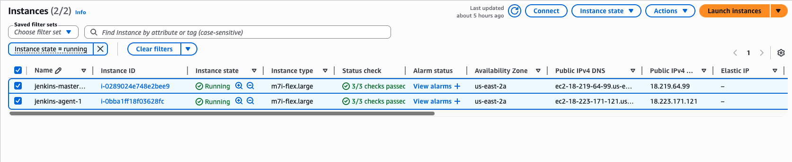
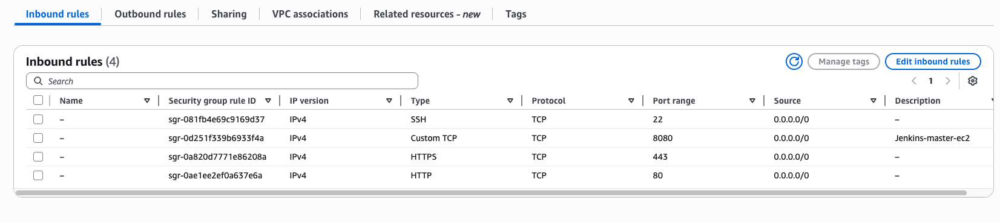
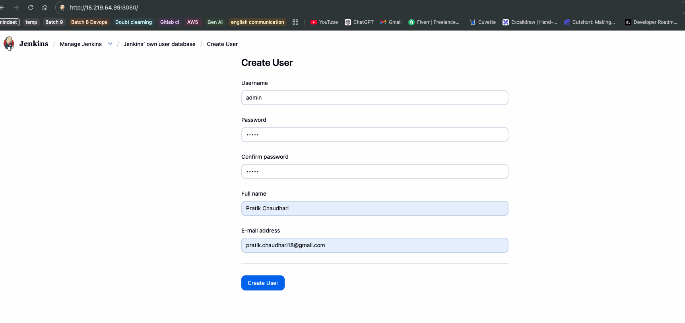
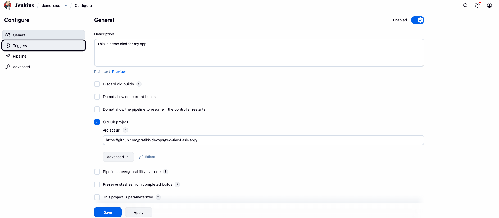
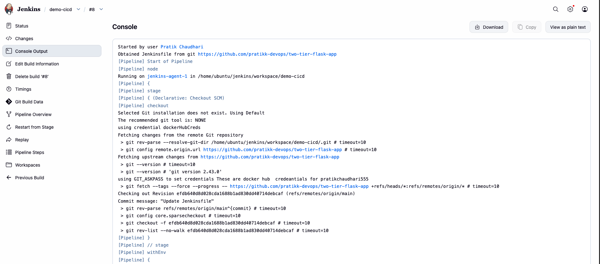
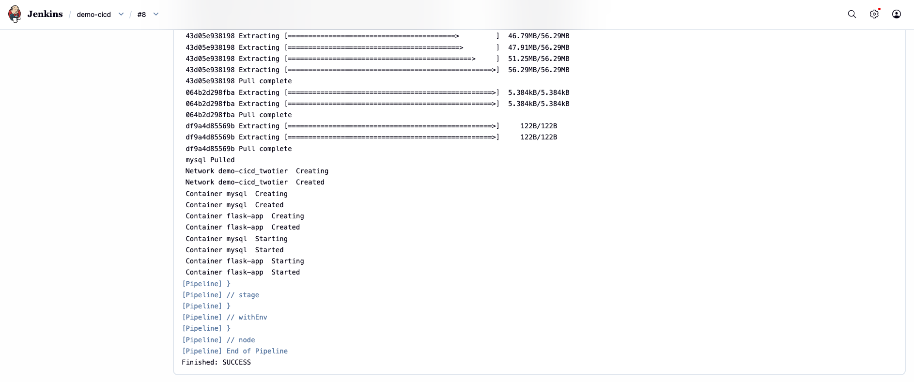
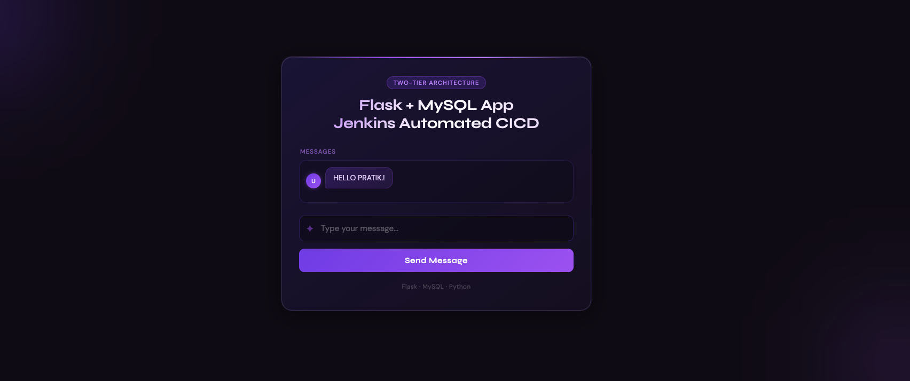

# Automated CI/CD Pipeline for a 2-Tier Flask Application on AWS

**Author:** Pratik Chaudhari @pratikk-devops
---
**workflow:** CODE (GitHub) → BUILD (Docker) → SCAN (Trivy) → TEST → PUSH (Docker Hub) → DEPLOY (server)

---

### **1. Project Overview**
This repository contains a simple two-tier Flask application (Flask + MySQL) and a Jenkins-based CI/CD pipeline with DevSecOps scanning (Trivy). This README documents how to set up Jenkins on AWS, create pipelines (master & agents), integrate Trivy file-system scans, build/push Docker images, and deploy via Docker Compose.

---

### **2. Architecture Diagram**

```
+-----------------+      +----------------------+      +-----------------------------+
|   Developer     |----->|     GitHub Repo      |----->|      Jenkins Server         |
| (pushes code)   |      | (Source Code Mgmt)   |      |     (on AWS EC2)            |
+-----------------+      +----------------------+      |                             |
                                                       | 1. Clones Repo              |
                                                       | 2. Trivy file system scan.  |
                                                       | 3. Builds Docker Image      |
                                                       | 4. Test                     |
                                                       | 5. Runs Docker Compose      |
                                                       +--------------+--------------+
                                                                      |
                                                                      | Deploys
                                                                      v
                                                       +-----------------------------+
                                                       |      Application Server     |
                                                       |(Agent/node or Same AWS EC2)|
                                                       |                             |
                                                       | +-------------------------+ |
                                                       | | Docker Container: Flask | |
                                                       | +-------------------------+ |
                                                       |              |              |
                                                       |              v              |
                                                       | +-------------------------+ |
                                                       | | Docker Container: MySQL | |
                                                       | +-------------------------+ |
                                                       +-----------------------------+
```

---

### **3. Step 1: AWS EC2 Instance Preparation**

1.  **Launch EC2 Instance:**
    * Navigate to the AWS EC2 console.
    * Launch a 2 new instance one as Jenkins sever and second as Agent server using the **Ubuntu Pro - Ubuntu Server Pro 24.04 LTS (HVM), SSD Volume Type** AMI.
    * Select the **m7i-flex.large** instance type for free-tier eligibility.
    * Create and assign a new key pair for SSH access.



2.  **Configure Security Group:**
    * Create a security group with the following inbound rules 8080 port in jenkins server and 5000 port in Agent server :
        * **Type:** SSH, **Protocol:** TCP, **Port:** 22, **Source:** Your IP
        * **Type:** HTTP, **Protocol:** TCP, **Port:** 80, **Source:** Anywhere (0.0.0.0/0)
        * **Type:** Custom TCP, **Protocol:** TCP, **Port:** 5000 (for Flask), **Source:** Anywhere (0.0.0.0/0)
        * **Type:** Custom TCP, **Protocol:** TCP, **Port:** 8080 (for Jenkins), **Source:** Anywhere (0.0.0.0/0)



3.  **Connect to EC2 Instance (both Jenkins server and Agent server):**
    * Use SSH to connect to the instance's public IP address.
    ```bash
    chmod 400 "key.pem"
    ssh -i /path/to/key.pem ubuntu@<ec2-public-ip>
    ```
4. **Connect jenkins server to Agent/node server :**
     ## Jenkins master → agent SSH setup

    Generate key on Jenkins:
      ssh-keygen -t ed25519 -f ~/.ssh/jenkins_agent_id -N ""

   Copy public key to agent:
      ssh-copy-id -i ~/.ssh/jenkins_agent_id.pub jenkins@AGENT_HOST

   Create credentials in Jenkins (SSH Username with private key) using the private key   file.

  Add a new node in Jenkins using "Launch agents via SSH" and test the connection.
---

### **4. Step 2: Install Dependencies on EC2**

1.  **Update System Packages:**
    ```bash
    sudo apt update && sudo apt upgrade -y
    ```

2.  **Install Git, Docker, and Docker Compose:**
    ```bash
    sudo apt-get install git docker.io 
    sudo apt-get install docker-compose-v2 -y
    ```

3.  **Start and Enable Docker:**
    ```bash
    sudo systemctl start docker
    sudo systemctl enable docker
    ```

4.  **Add User to Docker Group (to run docker without sudo):**
    ```bash
    sudo usermod -aG docker $USER
    newgrp docker
    sudo systemctl restart jenkins
    cat /etc/passwd or grep ‘^docker:’ /etc/group 
    ```
5. **Install-Trivy[DevSecOps]**
    
    # Install Trivy on the Jenkins node(s) or master where scans run:

    ```bash
    # Linux (apt-based example)
    sudo apt-get install -y wget apt-transport-https gnupg lsb-release
    wget -qO - https://aquasecurity.github.io/trivy-repo/deb/public.key | sudo apt-key add -
    echo deb https://aquasecurity.github.io/trivy-repo/deb $(lsb_release -sc) main | sudo tee                   /etc/apt/sources.list.d/trivy.list
    sudo apt-get update
    sudo apt-get install -y trivy
    ```

   # Basic file-system scan (as used in pipeline):

    ```bash
    trivy fs . -o results.json
    ```
    ---

### **5. Step 3: Jenkins Installation and Setup**

1.  **Install Java (OpenJDK 17):**
    ```bash
    sudo apt-get update
    sudo apt-get install -y fontconfig openjdk-21-jre
    java --version    
    ```

2.  **Add Jenkins Repository and Install:**
    ```bash
    ``bash
    sudo wget -O /etc/apt/keyrings/jenkins-keyring.asc \
    https://pkg.jenkins.io/debian-stable/jenkins.io-2026.key
    echo "deb [signed-by=/etc/apt/keyrings/jenkins-keyring.asc] https://pkg.jenkins.io/debian-stable binary/" | sudo tee /etc/apt/sources.list.d/jenkins.list > /dev/null
    sudo apt-get update
    sudo apt-get install -y jenkins
    ```

3.  **Start and Enable Jenkins Service:**
    ```bash
    sudo systemctl start jenkins
    sudo systemctl enable jenkins
    ```

4.  **Initial Jenkins Setup:**
    * Retrieve the initial admin password:
        ```bash
        sudo cat /var/lib/jenkins/secrets/initialAdminPassword
        ```
    * Access the Jenkins dashboard at `http://<ec2-public-ip>:8080`.
    * Paste the password, install suggested plugins, and create an admin user.

5.  **Grant Jenkins Docker Permissions:**
    ```bash
    sudo usermod -aG docker jenkins
    sudo systemctl restart jenkins
    ```


---

### **6. Step 4: GitHub Repository Configuration**

Ensure your GitHub repository contains the following three files.

#### **Dockerfile**
This file defines the environment for the Flask application container.
```dockerfile 
# Use an official Python runtime as the base image
FROM python:3.9-slim

# Set the working directory in the container
WORKDIR /app

# install required packages for system
RUN apt-get update \
    && apt-get upgrade -y \
    && apt-get install -y gcc default-libmysqlclient-dev pkg-config \
    && rm -rf /var/lib/apt/lists/*

# Copy the requirements file into the container
COPY requirements.txt .

# Install app dependencies
RUN pip install mysqlclient
RUN pip install --no-cache-dir -r requirements.txt

# Copy the rest of the application code
COPY . .

# Specify the command to run your application
CMD ["python", "app.py"]
```

#### **docker-compose.yml**
This file defines and orchestrates the multi-container application (Flask and MySQL).
```yaml
version: "3.8"

services:
  mysql:
    user: "${UID}:${GID}" 
    image: mysql:5.7
    container_name: mysql
    environment:
      MYSQL_ROOT_PASSWORD: root
      MYSQL_DATABASE: devops
      MYSQL_USER: admin
      MYSQL_PASSWORD: admin
    volumes:
      - ./mysql-data:/var/lib/mysql
      - ./message.sql:/docker-entrypoint-initdb.d/message.sql  
    networks:
      - twotier
    healthcheck:
      test: ["CMD", "mysqladmin", "ping", "-h", "localhost", "-uroot", "-proot"]
      interval: 10s
      timeout: 5s
      retries: 5
      start_period: 60s

  flask-app:
    image: pratikchaudhari555/two-tier-flask-app:latest
    container_name: flask-app
    ports:
      - "5000:5000"
    environment:
      MYSQL_HOST: mysql
      MYSQL_USER: root
      MYSQL_PASSWORD: root
      MYSQL_DB: devops
    depends_on:
      - mysql
    networks:
      - twotier
    restart: always
    healthcheck:
      test: ["CMD-SHELL", "curl -f http://localhost:5000/health || exit 1"]
      interval: 10s
      timeout: 5s
      retries: 5
      start_period: 30s

networks:
  twotier:
```

#### **Jenkinsfile**
This file contains the pipeline-as-code definition for Jenkins.
```groovy
@Library("Shared") _
pipeline{
    agent { label "dev"};
    
    stages{
        stage("CODE"){
            steps{
                script{
                   clone("https://github.com/pratikk-devops/two-tier-flask-app.git", "main")
               }                
            }
        }
        stage("Trivy File System Scan"){
            steps{
                script{
                    trivy_fs()
                }
            }
        }
        stage("BUILD"){
            steps{
                sh "docker build -t two-tier-flask-app ."
            }
        }
        stage("TEST")  {
            steps{
                echo"Developer/Tester writes the tests"
            }
        }
        stage("Push to Docker Hub")  {
            steps{
                 script{
                    docker_push("dockerHubCreds","two-tier-flask-app")
                }    
            }
        }
        stage("DEPLOY"){
            steps{
                sh "docker compose up -d --build flask-app"
            }
        }
    }
}
```

---

### **7. Step 5: Jenkins Pipeline Creation and Execution**

1.  **Create a New Pipeline Job in Jenkins:**
    * From the Jenkins dashboard, select **New Item**.
    * Name the project, choose **Pipeline**, and click **OK**.

2.  **Configure the Pipeline:**
    * In the project configuration, scroll to the **Pipeline** section.
    * Set **Definition** to **Pipeline script from SCM**.
    * Choose **Git** as the SCM.
    * Enter your GitHub repository URL.
    * Verify the **Script Path** is `Jenkinsfile`.
    * Enable "GitHub hook trigger for GITScm polling" in the   Jenkins job (Configure → Build Triggers).
    * Create a GitHub webhook to https://public-ip_jenkins_server/github-webhook/ (Content-Type: application/x-www-form-urlencoded; events: send me everything) to automate builds
    * Save the configuration.



3.  **Run the Pipeline :**
    * Click **Build Now** to trigger the pipeline manually for the first time.
    * or 
    * if any commits/changes in github the pipline automaticly build
    * Monitor the execution through the **Stage View** or **Console Output**.




4.  **Verify Deployment:**
    * After a successful build, your Flask application will be accessible at `http://<your-ec2-public-ip>:5000`.
    * Confirm the image build,push,pulled and containers are running on the EC2 instance with `docker images` & `docker ps -a`.




---

###
The CI/CD pipeline is now fully operational. Any `git push` to the `main` branch of the configured GitHub repository will automatically trigger the Jenkins pipeline, which will build the new Docker image and deploy the updated application, ensuring a seamless and automated workflow from development to production.

